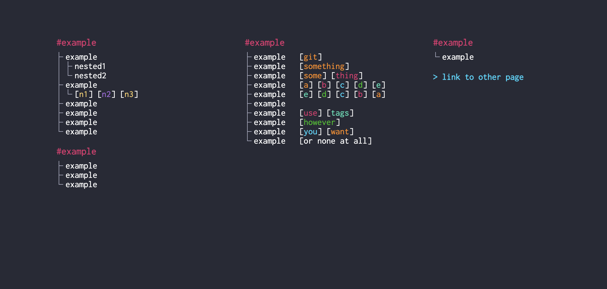

### Neon home

A new page replacement to organize bookmarks

Inspired by some examples from [here](https://www.reddit.com/r/startpages/)

#### Example



#### Instalation

This is an unpublished extension, so to install it you'll have to:

1. Go to `chrome:extensions`
1. Activate `Developer mode` on the right corner
1. Click `Load unpacked`
1. Select the extension's directory

#### Migration from 0.0.1 to 1.0.0

The 1.0.0 version added a more generic way of coloring tags.  
Instead of having arbitrary names like "git" automatically colored orange, now you have to specify the color for each tag (whichever you want).

**Before:** In 0.0.1, this tag will be colored orange, because the name matched "git"
```json
{
    "name": "my app",
    "href": "https://myapp.com/",
    "tags": [{
        "name": "git",
        "href": "http://github.com/me/my-app"
    }]
}
```

**After:** In 1.0.0, you need to inform the color of your tag, which can be whichever you want
```json
{
    "name": "my app",
    "href": "https://myapp.com/",
    "tags": [{
        "name": "git",
        "color": "pink",
        "href": "http://github.com/me/my-app"
    }]
}
```

To help with converting the `data.js` from the previous schema to the new one, a shell script was created.

**In the root of this app**, run the following:

```sh
./infra/migration01-10.sh
```

You can autoformat the resulting js to better readability.